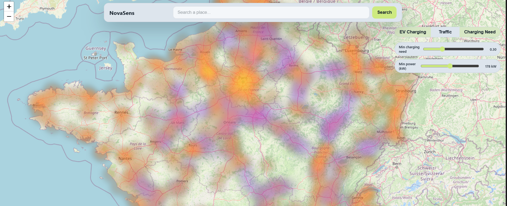

# NovaSens

NovaSens is a Tekno Hackathon prototype that layers EV charging supply, real traffic intensity, and a computed “charging need” score on top of a Leaflet map. It helps spot French corridors where fast-charging capacity should land first.



## Highlights
- Toggle between EV availability, traffic, and derived charging-need heatmaps.
- Filter by minimum charger power or charging-need threshold to focus insights.
- Click high-need zones to open a drawer with coordinates plus a synthetic ROI trend.

## Tech Stack
- React 18 + Vite 5
- react-leaflet + leaflet.heat
- Material UI + X-Charts
- Custom data processors in `src/utils`

## Quick Start
```powershell
cd "\Tekno-Hackathon\frontend"
npm install
npm run dev
```
Then open the URL printed by Vite (defaults to http://localhost:5173).

## Data
- `public/data/merged_ev_stations.json` – merged open EVSE datasets, normalized in `useEvStations`.
- `public/data/tmja-rrnc-2024.json` – TMJA traffic segments, normalized in `useTrafficSegments`.

> The ROI sparkline in the drawer is illustrative only; it uses a deterministic seeded RNG so each point feels consistent during demos.

## Scripts
- `npm run dev` – start the dev server
- `npm run build` – production build
- `npm run preview` – preview the production bundle

## Notes
- Requires Node.js 18+.
- Place your screenshot at `frontend/public/nova-sens-map.png` (replace with your own if needed).
